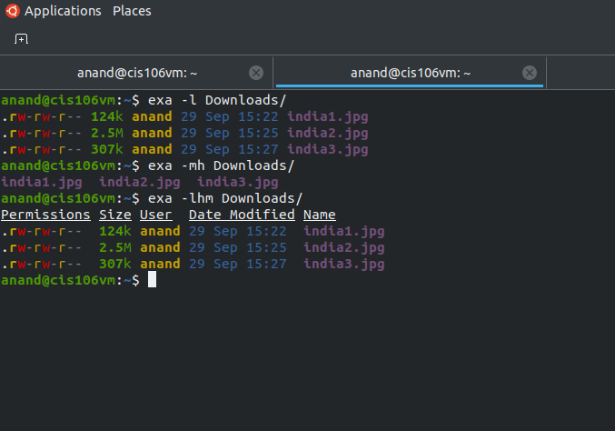

# Lab 3 | Installing software and navigating the file system | Answers
Assignment description [here](https://raw.githubusercontent.com/ra559/cis106/main/labs/lab3.md)

## Question 1
1. Which command did you use to search for the themes and to install them?
 * i used for this command line to search theme for = apt search 'gtk theme'.
 *  i installed breeze-gtk-theme in my computer and i used this command line for install= sudo apt install breeze-gtk-theme
2. Which commands did you use to find and install the web browser?
 *  i used this command line for find the web browser= apt search  web browser
 *  i used this command line for install = sudo apt install konqueror

3.1 What is the name of the package?
dustracing2d

3.2 What dependencies are needed in order to install the package? (you can either take a screenshot of the terminal or copy and paste from the terminal)

3.3 How much disk space will the package utilize after installation?
Need to get 4,590 kB of archives.
After this operation, 7,199 kB of additional disk space will be used.

## Question 2

## Question 3

## Question 4

## Question 5

