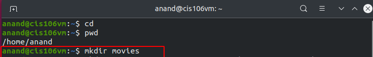
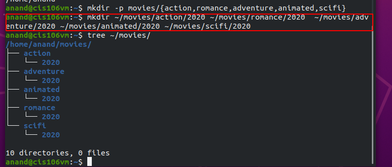
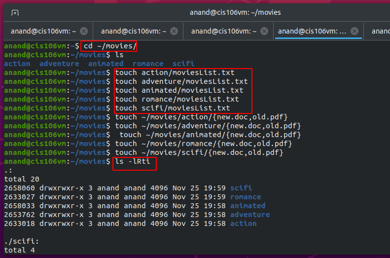
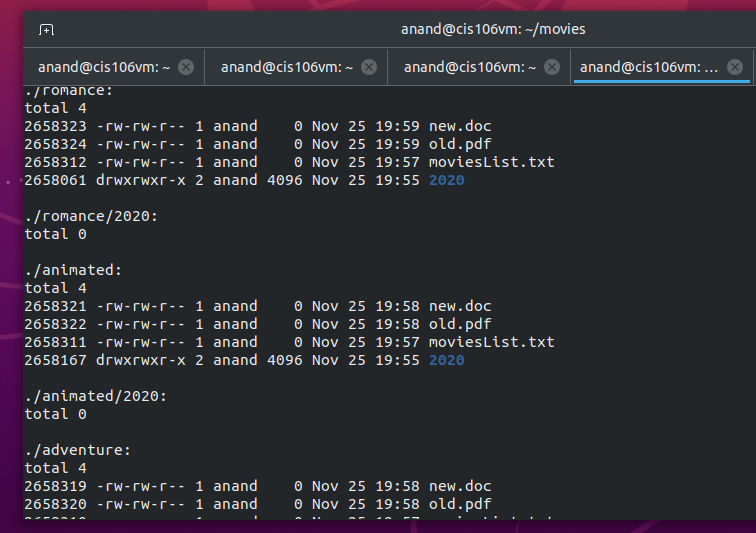
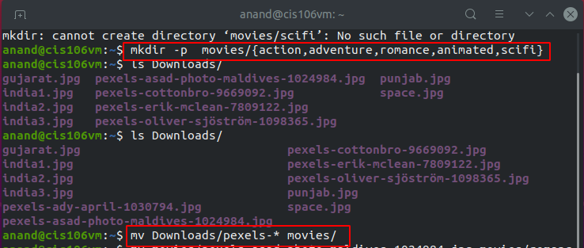
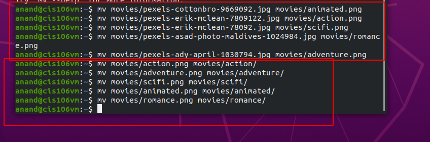
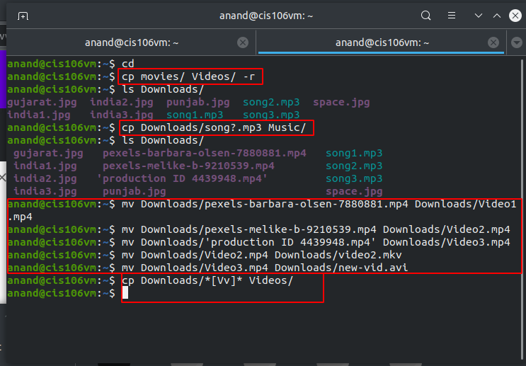

Lab 4 | Managing files and directories

* Question 1: Creating directories.

* Question 2: Creating files

* Question 3: Removing files

* Question 4: Moving files and directories

* Question 5: Copying files

